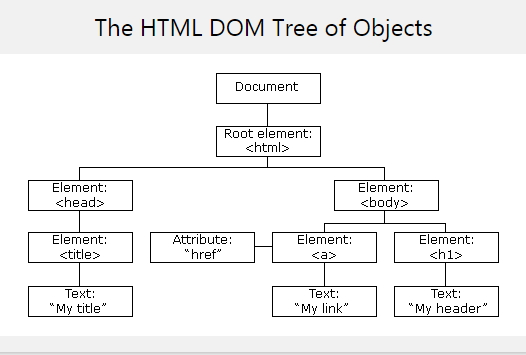

```
DOM
```

1. DOM은 내부적으로 HTML 태그를 Tree 형태로 표현합니다.

   

   * HTML DOM 활용


```
EX:
<!DOCTYPE html>
<html>
<body>
 
<p id="intro">Hello World!</p>
 
<p>This example demonstrates the <b>getElementById</b> method!</p>
 
<p id="demo"></p>
 
<script>
var myElement = document.getElementById("intro");
document.getElementById("demo").innerHTML = 
"The text from the intro paragraph is " + myElement.innerHTML;
</script>
 
</body>
</html>
```

1. 태그(Element)의 생성, 이미지 변경

   ```
   <!DOCTYPE html>
   <html>
   <head>
   <meta charset="UTF-8">
   <title>Insert title here</title>
   <script type="text/javascript">
       
       function imgShow(){
           // img 태그 생성
           var img = document.createElement("img");
           
           // img 태그의 src속성 설정
           img.src ="http://www.apache.org/images/ac2008us_343x114.jpg";
           
           // imgPlaceHolder DIV 태그 검색
           var holder = document.getElementById("imgPlaceHolder");
           
           // div 태그에 img 태그 추가
           holder.appendChild(img);
       }
       
    </script>
   </head>
   <body>
   <input type="button" onclick="imgShow();" value="이미지 표시"/>
     
   <div id="imgPlaceHolder"></div>
   </body>
   </html>
   ```

2. 체크 상자의 선택 상태를 읽거나 변경하기

   ```
   <!DOCTYPE html>
   <html>
   <head>
   <meta charset="UTF-8">
   <title>Insert title here</title>
   </head>
   <script type="text/javascript">
    // id를 받지 않는 경우
    function check(){ 
       document.getElementById("chkLCD").checked=true
    }
    
    function uncheck(){
       document.getElementById("chkLCD").checked=false
    }
    
    // id를 받는 경우
    function check2(id){ 
       document.getElementById(id).checked=true
    }
    
    function uncheck2(id){
       document.getElementById(id).checked=false
    } 
    
    // 선택된 체크 상자 구함
    function getOption(){
       var lcd = document.getElementById("chkLCD"); // 태그 검색
       var ram = document.getElementById("chkRAM"); // 태그 검색
       var printer = document.getElementById("chkPrinter"); // 태그 검색
       var str = "";
       
       if (lcd.checked == true){ 
           str = lcd.value + "   ";
       }   
    
       if (ram.checked == true){ 
           str = str + ram.value + "   ";
       }   
    
       if (printer.checked == true){ 
           str = str + printer.value;
       }   
           
       // alert(str); // 선택값의 출력
       document.getElementById('opt').value = str;
       
    }
   </script>
   <body>
   <form>
      <p>상품 옵션 선택 </p>
      <p>
        <input type="checkbox" id="chkLCD" value="LCD 24" />
        <input type="button" onClick="check()" value="LCD 24' 선택" />
        <input type="button" onClick="uncheck()" value="LCD 24' 선택 안함 " />
        </p>
      <p>
        <input type="checkbox" id="chkRAM" value="RAM 2G" />
        <input type="button" onClick="check2('chkRAM')" value="RAM 2G 선택" />
        <input type="button" onClick="uncheck2('chkRAM')" value="RAM 2G 선택 안함 " />
        </p>
      <p>
        <input type="checkbox" id="chkPrinter" value="프린터" />
        <input type="button" onClick="check2('chkPrinter')" value="프린터 선택" />
        <input type="button" onClick="uncheck2('chkPrinter')" value="프린터 선택 안함 " />
        </p>        
        <p>
       <input type="button" name="btnOpt" value="선택한 옵션" onClick="getOption()">
       <input type="text" id="opt" size="40">
        </p>
    </form>
   </body>
   </html>
   ```

   

4. 화면의 특정 영역을 동적으로 숨기거나 감추기

   ```
   <!DOCTYPE html>
   <html lang="en">
   <head>
       <meta charset="UTF-8">
       <meta http-equiv="X-UA-Compatible" content="IE=edge">
       <meta name="viewport" content="width=device-width, initial-scale=1.0">
       <title>Document</title>
       <script>
           function show(){
              // document.getElementById('content').style.visibility='';
              document.getElementById('content').style.display=''
           }
           function hide(){
               //document.getElementById('content').style.visibility='hidden';
               document.getElementById('content').style.display='none';
           }
       </script>
   </head>
   <body>
       <div id="content">
           DIV 태그 출력<br/>
        
       </div>
    
       <button onclick="show()">div 보이기</button>
       <button onclick="hide()">div 숨기기</button>
    
   </body>
   </html>
   ```

   

5.텍스트의 링크를 동적으로 변경하기

```
<!DOCTYPE html>
<html lang="en">
<head>
    <meta charset="UTF-8">
    <meta http-equiv="X-UA-Compatible" content="IE=edge">
    <meta name="viewport" content="width=device-width, initial-scale=1.0">
    <title>Document</title>
    <script>
        function url(addr){
            document.getElementById('thelink').href=addr;
        }
 
        function display(){
            alert('display 함수가 호출 되었습니다.');
        }
    </script>
</head>
<body>
    <a id="thelink">클릭하세요</a>
    <button onclick="url('https://www.kma.go.kr')">기상청</button>
    <button onclick="url('https://www.yahoo.com')">야후</button>
    <button onclick="url('javascript:display()')">함수호출</button>
 
</body>
</html>
```

6. 텍스트를 div 태그로 감싸서 추가하기

   ```
   <!DOCTYPE html>
   <html>
   <head>
   <meta charset="UTF-8">
    
   <script type="text/javascript">
    function show()
    { 
       // DIV 태그 검색
       var parentdiv = document.getElementById("textHolder");
       // 새로운 DIV 태그 생성
       var divel = document.createElement("div");
       // 새로운 DIV태그에 텍스트 생성
       divel.appendChild(document.createTextNode("CBD Developer 8"));
       // 새로운 DIV 태그를 부모 DIV 태그인 'textHolder'에 추가
       parentdiv.appendChild(divel);
    
    }
    
   </script>
   </head>
   <body>
     <input type="button" onclick="show()" value="텍스트 추가" />
     <div id="textHolder"></div>
   </body>
   </html>
    
   ```

   